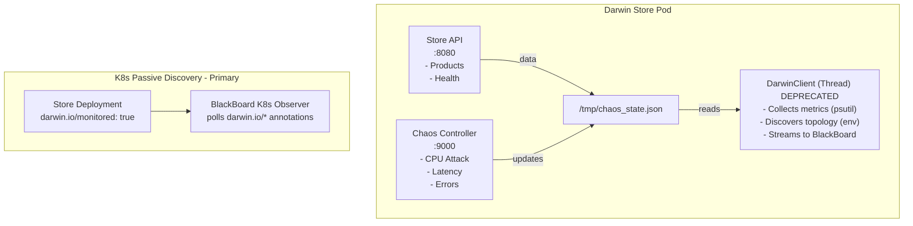

# Darwin Store

A self-aware vulnerable application for Darwin demos. The Store is discovered by the Darwin BlackBoard brain via `darwin.io/*` Kubernetes annotations on the Deployment resource. It also accepts chaos injection from the Chaos Controller.

## Service Discovery

The Store uses **annotation-based passive discovery**. The BlackBoard K8s Observer polls Deployment annotations to register services, extract GitOps coordinates, and build the topology graph.

| Annotation | Value | Purpose |
|------------|-------|---------|
| `darwin.io/monitored` | `"true"` | Opts the Deployment into Darwin observation |
| `darwin.io/gitops-repo` | `"https://github.com/The-Darwin-Project/Store.git"` | Git repo URL for SysAdmin remediation |
| `darwin.io/helm-path` | `"helm/values.yaml"` | Helm values path within the repo |
| `darwin.io/service-name` | `"darwin-store"` | Logical service name in the topology |

> **Deprecation notice:** The `DarwinClient` push telemetry module (`src/app/darwin_client.py`) is deprecated. It still runs during the transition period but will be removed in a future release. All new services should use `darwin.io/*` annotations instead.

## Architecture



## Quick Start

### Local Development

```bash
# Install dependencies
cd Store
pip install -r requirements.txt

# Run Store API (port 8080)
uvicorn src.app.main:app --port 8080 &

# Run Chaos Controller (port 9000)
uvicorn src.chaos.main:app --port 9000 &

# Test health
curl http://localhost:8080/
# {"status":"store_online","service":"darwin-store","version":"1.0.0"}

# Test products
curl http://localhost:8080/products
# []

# Open Chaos UI
open http://localhost:9000/
```

### Helm Deployment (OpenShift)

```bash
# Install with defaults
helm install darwin-store ./helm

# Install with custom values
helm install darwin-store ./helm \
  --set darwin.url=http://my-blackboard:8000 \
  --set postgres.persistence.size=2Gi

# Disable persistence for quick PoC
helm install darwin-store ./helm \
  --set postgres.persistence.enabled=false

# Verify deployment
helm template ./helm
kubectl get pods -l app=darwin-store
```

## API Reference

### Store API (Port 8080)

| Endpoint           | Method | Description       |
|--------------------|--------|------------------|
| `/`                | GET    | Health check     |
| `/products`        | GET    | List all products|
| `/products/{id}`   | GET    | Get product by ID|
| `/products`        | POST   | Create product   |
| `/products/{id}`   | PUT    | Full replace product (all fields required) |
| `/products/{id}`   | PATCH  | Partial update product (only provided fields) |
| `/products/{id}`   | DELETE | Delete product   |

### Chaos API (Port 9000)

All chaos mutations go through a single settings endpoint. Pydantic validates all inputs.

| Endpoint         | Method | Description                          |
|------------------|--------|--------------------------------------|
| `/`              | GET    | Chaos UI                             |
| `/api/status`    | GET    | Current chaos state + thread/memory info |
| `/api/settings`  | POST   | Update chaos settings (JSON body)    |

#### `POST /api/settings` Body Fields

All fields are optional. Only provided fields are applied.

| Field         | Type  | Range       | Description                    |
|---------------|-------|-------------|--------------------------------|
| `cpu_threads` | int   | 0-8         | CPU burn threads (0 = off)     |
| `memory_mb`   | int   | 0-200       | Memory allocation in MB        |
| `latency_ms`  | int   | 0-30000     | Latency injected per request   |
| `error_rate`  | float | 0.0-1.0     | Probability of 500 error       |
| `reset`       | bool  | true/false  | Reset all settings to defaults |

## Chaos Examples

### CPU Attack

Starts busy-loop threads that burn CPU cycles. Visible to Darwin BlackBoard via telemetry.

```bash
# Start 4 CPU burn threads
curl -X POST http://localhost:9000/api/settings \
  -H 'Content-Type: application/json' \
  -d '{"cpu_threads": 4}'

# Stop CPU burn
curl -X POST http://localhost:9000/api/settings \
  -H 'Content-Type: application/json' \
  -d '{"cpu_threads": 0}'
```

### Memory Pressure

Allocates memory in 10MB chunks. Capped at 200MB (container limit safety margin).

```bash
curl -X POST http://localhost:9000/api/settings \
  -H 'Content-Type: application/json' \
  -d '{"memory_mb": 100}'
```

### Latency Injection

Adds artificial delay to all Store API requests (requires `CHAOS_MODE=enabled`).

```bash
curl -X POST http://localhost:9000/api/settings \
  -H 'Content-Type: application/json' \
  -d '{"latency_ms": 1000}'

# Verify (should take >1s)
time curl http://localhost:8080/products
```

### Error Injection

Returns HTTP 500 errors probabilistically (requires `CHAOS_MODE=enabled`).

```bash
curl -X POST http://localhost:9000/api/settings \
  -H 'Content-Type: application/json' \
  -d '{"error_rate": 0.5}'

# 50% of requests will return 500
curl http://localhost:8080/products
```

### Reset All

```bash
curl -X POST http://localhost:9000/api/settings \
  -H 'Content-Type: application/json' \
  -d '{"reset": true}'
```

## Telemetry Schema (Deprecated)

> **Deprecated:** Push telemetry via DarwinClient will be removed in a future release.
> The BlackBoard K8s Observer now passively discovers services via `darwin.io/*` annotations
> and reads metrics from the Kubernetes metrics-server.

The Store currently pushes telemetry to Darwin BlackBoard every 5 seconds:

```json
{
  "service": "darwin-store",
  "version": "1.0.0",
  "metrics": {
    "cpu": 45.2,
    "memory": 62.1,
    "error_rate": 5.0
  },
  "topology": {
    "dependencies": [
      {
        "target": "postgres-db",
        "type": "db",
        "env_var": "DATABASE_URL"
      }
    ]
  }
}
```

**Important:** The `env_var` field contains the environment variable KEY name (not the value). This allows the Darwin SysAdmin Agent to construct `kubectl patch` commands.

## Configuration

### Environment Variables

| Variable         | Default                         | Description                 |
|------------------|---------------------------------|-----------------------------|
| `SERVICE_NAME`   | `darwin-store`                  | Service name in telemetry   |
| `SERVICE_VERSION`| `1.0.0`                         | Service version in telemetry|
| `DARWIN_URL`     | `http://darwin-blackboard:8000` | BlackBoard URL              |
| `DATABASE_URL`   | (none)                          | Postgres connection string  |
| `CHAOS_MODE`     | `disabled`                      | Gates ChaosMiddleware latency/error injection. Set to `enabled` to activate. CPU/memory attacks are unaffected. |

### Helm Values

See `helm/values.yaml` for all configurable options:

- `image.*` - Container image settings
- `darwin.*` - BlackBoard connection
- `postgres.*` - Postgres StatefulSet settings
- `resources.*` - Resource limits
- `*SecurityContext` - Security settings

## Cross-Process State

The Store and Chaos Controller run as separate uvicorn processes in the same container. They share state via a file-backed JSON store at `/tmp/chaos_state.json` using atomic `tempfile` + `os.replace` writes (POSIX rename atomicity). Reads use retry with exponential backoff for concurrent access safety.

This is a PoC pattern. For production, use Redis or shared memory.
